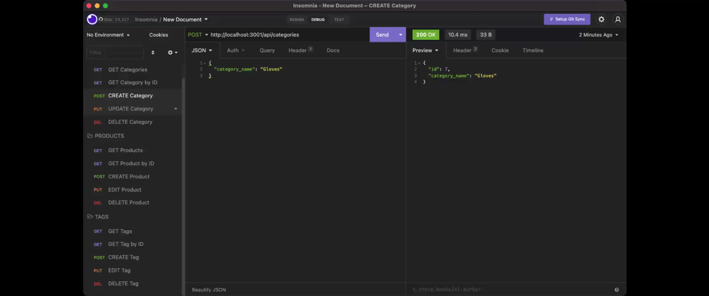
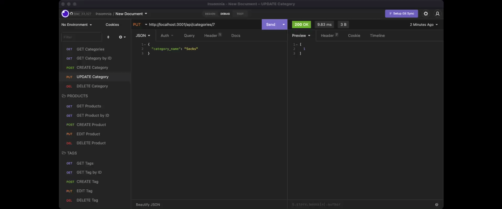

# E-Commerce Back End Application
This is a back end application for an e-commerce that will allow the user to view categories, products, and tags in different ways. 

This application was created with a starter code. Express.js API is configured for Sequelize to interact with a MySQL database.

## Installation
In able to execuse the application, you will have to `git clone` the repository into your local storage. This will enable you to access all the files locally.

Run `npm install` in order to have npm package dependencies installed.
* The application will start once the user enters `npm start` in the command line.
* Once the application is running, user will have to use INSOMNIA and create a new `HTTP Request` using `http://localhost:3001/api/categories`

## Usage
* User will be able to do the following:
> Pull all Categories, Products, and Tags

> Pull specific Categories, Products, and Tags, using ID

>Create new Categories, Products, and Tags

> Update existing Categories, Products, and Tags

> Delete exisiting Categories, Products, and Tags

## Demo
* Running schema.sql to execute database

* Seeding database

* Starting the app in terminal

* Pulling all categories details, product details, and tag details

* Pull certain category detail, product detail, or tag detail using ID.

* Creating new category, product, or tag

* Updating existing category, product, or tag

* Deleting existing category, product, or tag

## Video Links to Full Demo

[TERMINAL DEMO](https://drive.google.com/file/d/1dAVjoH1e3RODf4Ppdfxq_WoifBBg7blS/view)

[INSOMNIA DEMO](https://drive.google.com/file/d/1dAVjoH1e3RODf4Ppdfxq_WoifBBg7blS/view)
